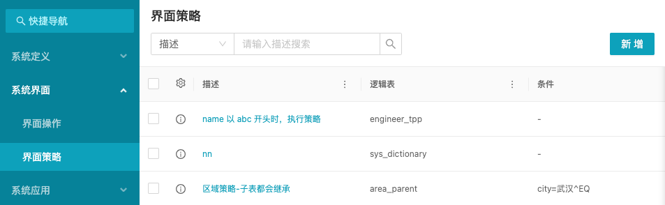
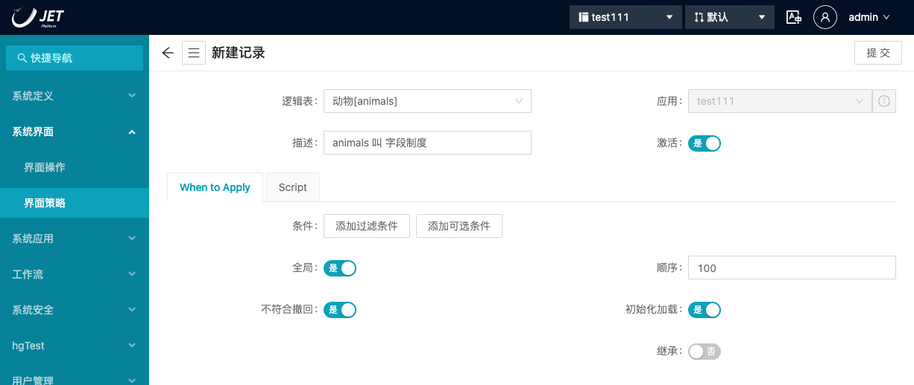
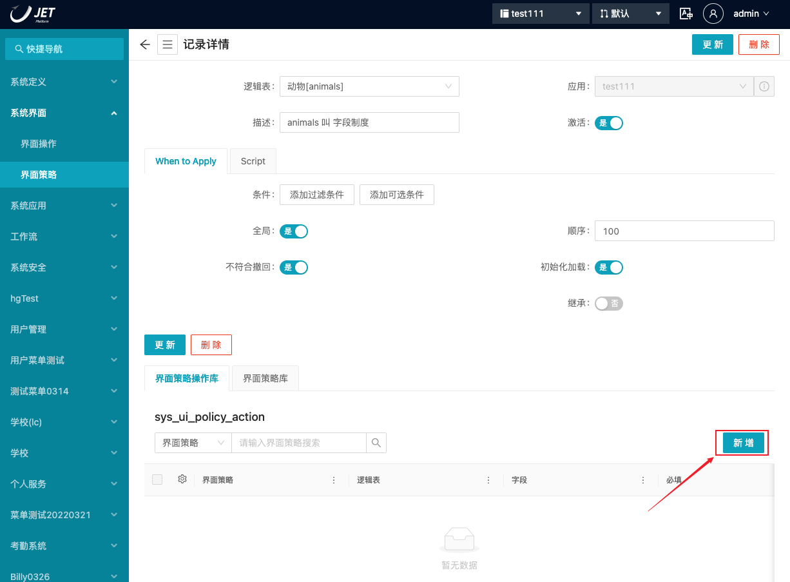
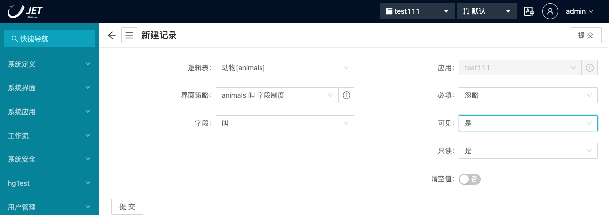

**UI Policies**上的**Order**字段（就像在其他脚本上一样）非常重要，因为它决定了 界面策略如何处理和优先处理操作。当两个 界面策略包含作用于同一字段的 界面策略操作时——即使它们作用于该字段的不同属性（例如，可见与只读）——它们可能会发生冲突。 ~~有冲突的 界面策略操作将显示在 界面策略的相关列表中，并用红点指示问题：~~

如果您打开 界面策略操作，您将看到一条错误消息，指示 界面策略操作的运行顺序是不可预测的：

**仅当父 界面策略上的Order**字段在两者上设置相同时才会出现此警告。**界面策略在Order**字段指示的另一个中执行，从一个开始。值越高，执行越晚。这也意味着**Order**字段中的较高值意味着该策略将优先于具有较低 order 值的其他策略。它不一定会撤消低阶策略执行的任何操作，但会覆盖它们。

**订单**字段的默认值为`100`。与大多数数字字段一样，当您对另一条记录使用不同的顺序值时，通常最好在其中放置一些*空格*。例如，如果我们想添加另一个优先于这个的 界面策略，我们可以选择一个左右的**订单**值`200`。这样，如果我们后来决定希望一个或多个其他策略按照顺序插入它们之间，我们可以使用`125`，中间留有足够的空间。`150``175`

离开房间的另一个例子是一个好主意，是**任务**记录上的**状态**字段。由于**State**在技术上是一个整数字段（每个标签，例如**New**、**Work in Progress**、**Closed Complete**等，都对应一个整数值），因此在创建时在前一个和下一个数字之间放置一些空格是个好主意一个新的**状态**选项。在这种情况下，最好提前考虑，因为*将来你*会感激的。

## 演示

让我们探索界面策略以一种不那么抽象的方式：通过创建一个！让我们创建一个 界面策略，以便在填充**动物**表单中的**叫**字段时，它将是只读的。这样，用户就不能为一个**动物**创建一个**叫**这个字段，然后将其切换到另一个事件。

