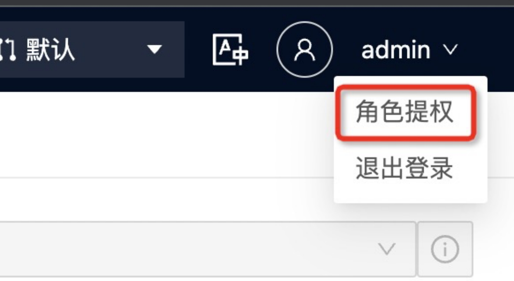
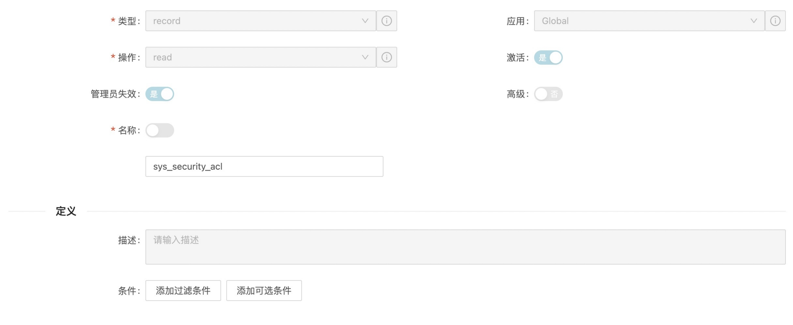

## **ACL安全规则**

在上一章中，我们简要涉及**访问控制**以及如何使用它们来控制字段在表单上是否可见或只读。但是，**访问控制** 也有一个服务器端组件，这与 UI 策略和数据策略之间的交叉并没有完全不同，只是您可以为 **访问控制** 编写条件脚本。**您可以通过导航到 系统安全**（菜单） |访问 JET 中的安全规则。**应用程序导航器中的访问控制 (ACL)**。这将带您进入**访问控制**[ sys_security_acl] 表列表。

### **提示**

由于我们将使用安全规则，让我们首先检查是否需要提升我们的权限。鼠标悬浮到横幅框架中 JET 界面右上角的用户名，查看是否可以选择**角色提权**。如果是，请单击它，并确保security_admin选中该复选框，然后单击**OK**。稍后将详细了解高安全性设置和权限提升。

 

**访问控制** 在JET 指定三个主要组件：受保护的对象（类型）、保护对象的操作以及通过安全规则所需的权限和/或条件。ACL的**名称**描述并定义了 ACL 应该应用的记录类型：对象。字段类型 ACL 的对象如下所示：

访问控制 记录上的**操作**字段定义 ACL 保护的操作，例如**read**、**write**、**report**或**delete**。ACL 记录的另一个主要组件是**管理员失效**切换。如果此字段设置为是，那么管理员将自动有权访问 ACL 保护的任何对象，即使他们没有被检查的特定角色。

### **提示**

gs.hasRole('role_name')当使用服务器端脚本或客户端脚本中的函数验证脚本中的权限时，如果**管理员失效**设置为 是 ，则g_user.hasRole('role_name')拥有 admin 角色将导致这些检查也始终返回。但是，您可以通过在客户端脚本和服务器上使用( ) 的API来绕过此行为。

表单的**访问角色**部分包含用户必须具有的角色，以传递 ACL 的角色部分。除了角色之外，记录上的**条件**字段和**脚本**字段（如果选中**高级**复选框）还必须开启，允许相关用户执行相关操作（读取、写入、删除， 等等）。

JET使用*默认拒绝*安全模型，这意味着默认情况下，任何没有许可安全规则的对象都是不可访问的。

一般访问JET 推荐的起点指南包括向所有用户授予对任何与任务相关的对象的**读取访问权限。**对象包括表、记录、字段和页面。他们还建议根据可能需要访问权限的人授予特定用户或组的**写入权限。**至于**删除**权限，JET建议除特殊情况外不授予任何人访问此功能的权限。这是因为删除记录可能会导致一些意想不到的影响，包括损坏的引用。相反，几乎总是最好停用记录（将**激活**设置为关闭）。大多数默认安全配置，至少在涉及到任务表和用户表等表时，已经设置为开箱即用！

表级安全规则授予或允许访问特定表。在大多数情况下，没有特定的 ACL 授予或拒绝给定表中每个字段的访问权限。相反，通常有一个较低级别的规则被继承。如果您没有对给定表的给定操作类型（读、写、删除等）的访问权限，则无法对其中的任何记录执行该操作；即使您拥有必要的字段级权限。

表 ACL 以特定顺序进行评估 - 按特异性顺序。首先，安全评估程序检查与表名匹配的 ACL（例如，incident或sc_req_item）。如果未找到，则评估器检查与父表匹配的 ACL，如果该表扩展了另一个表。如果没有找到这样的 ACL（或者如果该表是基表），则评估程序最终会检查通配符表 ACL ( *)。

字段级 ACL 逐个字段授予或允许访问权限。用户必须同时访问表和字段才能查看给定记录上的字段。字段级 ACL 可以使用通配符（星号）来控制对给定表上所有字段的访问，方法是使用 name table_name.*。

查看 ACL与给定表的记录相关联，如果您启用了高安全性设置并且尚未启用，则首先**提升角色（并记住您必须为每个新会话执行此操作）。**然后，右键单击表格的标题，该表格显示您要查看 ACL 的记录类型（例如**事件**表），然后导航到**配置**| **安全规则**。

## **ACL进程顺序**

当用户请求访问对象（例如通过加载列表或表单），评估 ACL 以确定用户是否可以看到该对象。首先，系统检查是否找到了适用的 ACL 规则。如果不是，则系统根据默认 ACL ( *.*) 授予访问权限，除非启用了高安全性插件，或者默认 ACL 设置为限制性而不是允许性时。找到相关 ACL 后，系统会按以下方式评估访问请求：

· **用户是否具有 ACL 的 ****访问角色**** **embedded 列表中指定的角色之一？

· **ACL 中指定的条件**是否设置为true？

· ACL**脚本**字段中的脚本是否返回true？

如果所有这三个条件都返回true或为空（例如，如果未指定脚本，我们可以假设它返回true），则授予用户访问该对象的权限。但是，即使其中一个设置为false，则用户将被拒绝访问（除非存在另一个 ACL 覆盖该 ACL）。

用户只需在表级别传递一个 ACL 即可访问该表，一个 ACL 即可访问给定对象。如果有多个相关的ACL，用户不需要每个都满足。

### **提示**

通常，可以缓存 ACL 结果。帐户权限和安全性也几乎总是缓存在用户的会话中。因此，在调整安全规则时，最好在测试前先让用户退出再登录。在以管理员身份进行测试时，取消模拟然后重新模拟用户会话通常就足够了，因为这会重新加载他们的安全上下文，就像注销并重新登录一样。

正如我们在上一节，当用户请求访问给定对象（例如记录上的字段）时，系统首先会检测是否为该记录找到了 ACL，但这也是按照一定的顺序进行检测的：

1. 搜索 ACL 名称匹配table_name.field_name

2. 如果没有找到，搜索匹配的 ACLparent_table_name.field_name

3. 如果未找到，请尝试*.field_name (* = wildcard)— 在任何表中的该字段上搜索 ACL

4. 如果未找到，请尝试parent_table.*使用通配符匹配表中所有字段的 ACL

5. 最后，如果这些都不起作用，请评估通配符*.*ACL，这可能是允许的，或者如果启用了高安全性，则可能是限制性的

 

 