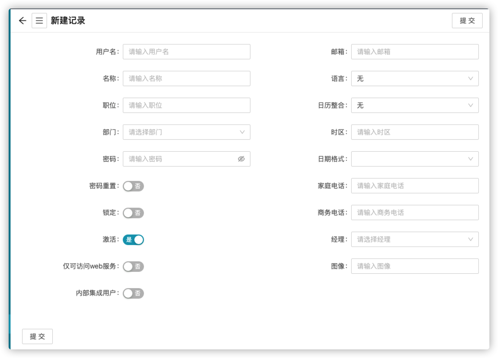

## 什么是用户？

JET中的用户帐户在很大程度上只是数据库中的另一种类型的记录。用户记录存储在**Users**[sys_user]表中，并定义可以登录和访问实例的用户。相关表（特别的，**Roles**[sys_user_role]表）控制用户的访问级别，但定义和包含帐户本身的是**Users**表，包括用户的电子邮件地址、电话号码、用户名（用于登录JET）等附加数据，甚至密码（<!--存储为单向加密散列(不知道是不是单向加密散列)-->）：

用户是一个记录，对应于一组权限（角色）和组，当然，还对应于一个真实的人！

